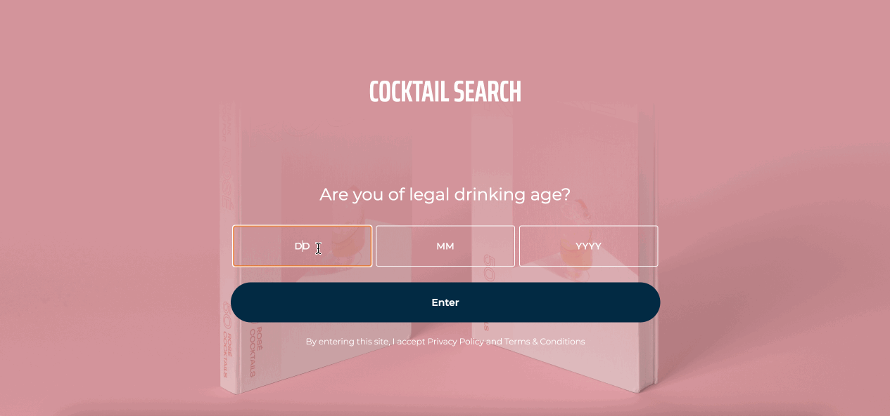

# Find your perfect cocktail

See the live version of this project:

- 🍹 [Cocktail Search App](https://cocktailsearch-demo.netlify.app)

The goal of this project is to provide a sleek and interactive way to generate cocktail recipes based on user input. Users select a base alcohol (Gin, Vodka, Tequila) and add ingredients they currently have at home. The app then fetches relevant drink recipes from a cocktail API, displaying all matching options along with full instructions and a visual breakdown of which ingredients the user is missing.

The project also includes an age verification gate to ensure the user is legally allowed to view alcohol-related content.

**Main features**:
- Select a base alcohol (Gin, Vodka, Tequila) and input available ingredients.
- Receive cocktail recipes that match your selected inputs.
- View full instructions, ingredient lists, and which items you’re missing.
- Age verification screen that blocks access for users under 18.

&nbsp;

## 💡 Technologies used


&nbsp;

## 💿 Installation

To install and run the project locally:

```bash
git clone https://github.com/your-username/cocktail-generator-app.git
cd cocktail-generator-app
npm install
npm start
```

App will be available at: `http://localhost:3000`

&nbsp;

## 🤔 Key components

### ✅ Age verification

A form that checks if the user is over 18. The data is validated and stored in localStorage. If the user is underage, access is denied.

```tsx
if (age >= 18) {
  localStorage.setItem('savedAge', age.toString());
  setIsVisible(true);
} else {
  localStorage.removeItem('savedAge');
  setIsVisible(false);
}
```

### 🧠 Recipe filtering

Once a user selects a base alcohol and inputs ingredients, the app fetches and filters drinks dynamically. Matching recipes are displayed with clickable cards that expand to reveal full details.

```tsx
const filtered = drinks.filter((recipe) => {
  return selectedIngredients.some((ingredient) =>
    recipe.strIngredient1?.toLowerCase().includes(ingredient.toLowerCase())
  );
});
```

### 🎯 Missing ingredients detection

For each recipe, the app highlights which ingredients are missing. User-selected ones are shown in green, missing ones in red.

```tsx
if (selectedIngredientstoLower.includes(ingredient.toLowerCase())) {
  color: '#008e00';
} else {
  color: '#d13030';
}
```

## 💭 Next steps / Improvements

- Add **search history** so users can revisit past recipes.
- Improve **error handling** when fetching data from the API.
- Consider introducing **React Context** or **Redux** for state management if the app grows.

&nbsp;

## 🙋‍♂️ Contact

If you enjoyed this project or want to collaborate:

[](https://www.linkedin.com/in/marcel-piaszczyk-200ba8181/)
[](mailto:marcel.piaszczyk@gmail.com)

&nbsp;

## 👏 Special thanks

Thanks to [TheCocktailDB](https://www.thecocktaildb.com/) for the open API used in this project.
